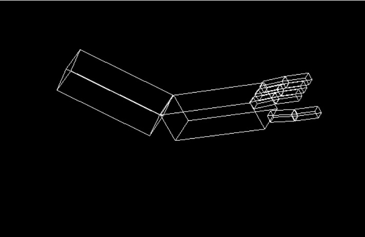
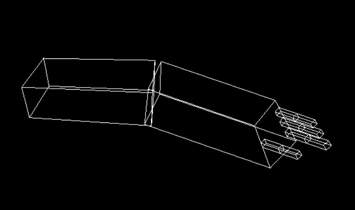
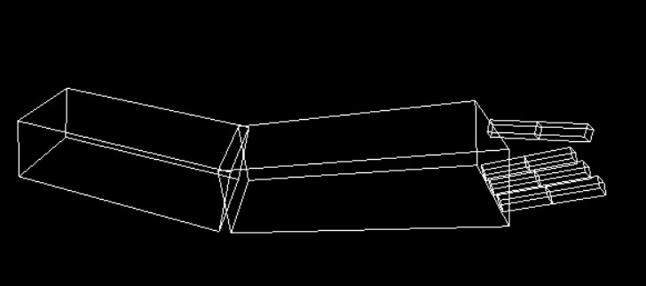
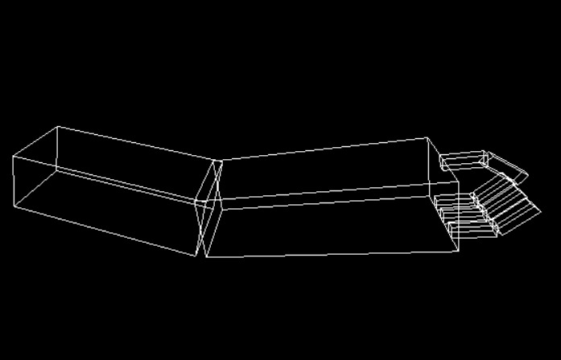
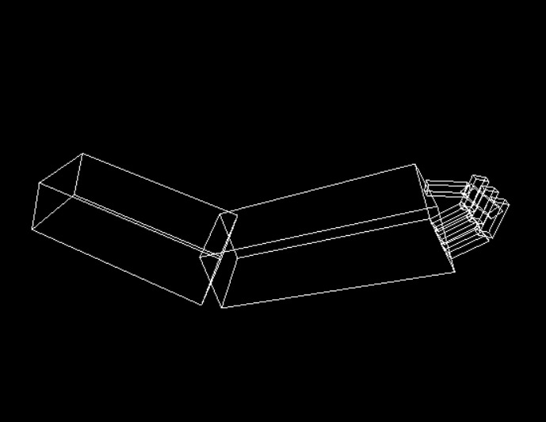

# Task 1 

* ## Name : _Noura Mahmoud Sayed_
* ## Sec : 2
* ## BN : 38

#

## _Implementation_

This model of robotic arm is based on the idea of push and pop of matrix. At first we created the shoulder part then the elbow and the hand including fingers. the location of each finger depends on its coordinates. 

Using keyboard keys, we can control the movement of : shoulder(s), elbow(e), base of fingers(f) and the finger up(g) each according to its degree of freedom.

#

## _Problems_
I wanted to make the rotation of elbow to be around the edge of elbow instead of the central line but I couldn't.  
#

## _Required model_

## _My model_ 
###### (on pressing "e")

### _on pressing " f "_

### _on pressing " g "_

### _comprehensive motion_

